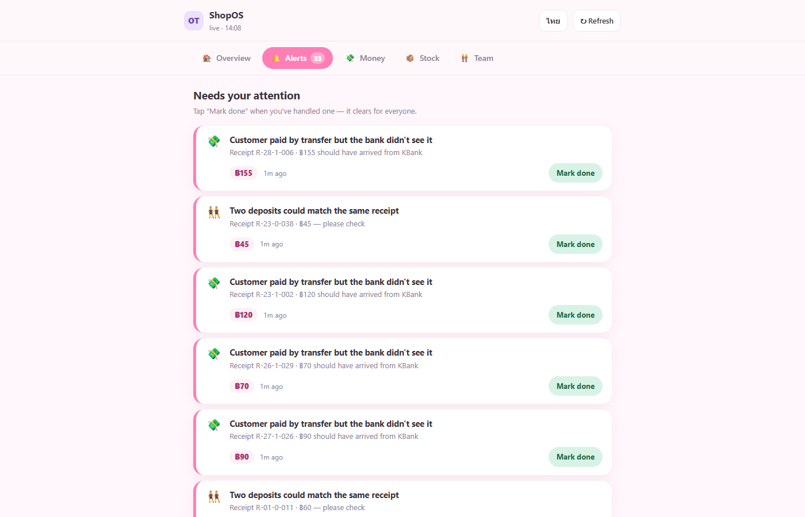

# ShopOS

[](https://github.com/Grechka67/ShopOs/actions/workflows/ci.yml)

**Retail Operations Platform** — a self-hosted back office for a **small, cash-heavy retail store**
that reconciles every money and stock movement into **one source of truth** and automatically flags
what doesn't add up.




A small shop's data is scattered across disconnected tools: sales sit in the POS, bank-transfer
payments arrive as phone SMS, the cash drawer is counted by hand, stock is on a spreadsheet, and
staff hours are on a fingerprint scanner. Money and inventory quietly leak in the gaps between them.
ShopOS ingests all of these, matches them against each other, and raises an alert the moment a
transfer never arrived, the drawer is short, or stock went missing.

> ⚠️ **Portfolio / demo project.** It runs end-to-end on **synthetic data** out of the box. The
> architecture is production-shaped, but treat it as a learning/showcase project — see
> [Status & limitations](#status--limitations) before pointing it at a real business.

---

## What it does

- **Ingests** four real-world sources into a single append-only event log:
  POS receipts (Loyverse), bank-deposit SMS (KBank), fingerprint attendance (NeoCall),
  and staff-entered cash/stock counts.
- **Reconciles** transfer-paid sales against actual bank deposits within a time window.
- **Detects anomalies** — unmatched transfers, cash-drawer shortages, inventory shrinkage,
  suspicious void bursts.
- **Surfaces it all** on a live web dashboard (store-health score, alerts feed, money/stock/team
  tables) plus optional Metabase dashboards, with critical alerts pushed to LINE.

## Try it in ~3 minutes

**Requirements:** Docker Desktop

```bash
cp .env.example .env
# REQUIRED — fill these 4 secrets in .env (the stack refuses to start with blank/default ones):
#   POSTGRES_PASSWORD, ADMIN_API_KEY, KBANK_SMS_HMAC_SECRET, METABASE_ENCRYPTION_KEY
# Generate strong values with:
#   python -c "import secrets; print(secrets.token_urlsafe(32))"

docker compose up -d

# wait ~60s for healthchecks, then load 30 days of synthetic data with planted anomalies.
# (OT_ALLOW_SEED=1 is a safety guard — the seeder TRUNCATEs tables, so it refuses to run without it.)
docker compose exec -e OT_ALLOW_SEED=1 backend python scripts/seed_demo_data.py
```

Then open in your browser:

| What | URL |
|------|-----|
| **▶ Live dashboard** (start here) | http://localhost:8000/dashboard |
| API explorer (OpenAPI) | http://localhost:8000/docs |
| Metabase (build your own charts) | http://localhost:3000 |
| n8n (workflow automation) | http://localhost:5678 |

All ports bind to `127.0.0.1` only — nothing is exposed to your network.

## Architecture

```
Loyverse POS / KBank SMS / NeoCall / Staff counts
            │
            ▼
       FastAPI ingestion  ──►  append-only `events` table  (audit-immutable)
            │                          │
            ▼                          ▼  projected into typed tables
   PostgreSQL 16 + TimescaleDB  ◄─── single source of truth
            │
   ┌────────┼─────────┐
   ▼        ▼         ▼
 Live    Reconciler  Metabase
dashboard + Anomaly  (manager
 (FastAPI) (cron)     dashboards)
            │
            ▼
        n8n → LINE Notify (critical alerts)
```

**Core idea:** every source writes to the append-only `events` table *first*, then gets projected
into clean typed tables. Nothing is ever silently edited — that's the audit trail.

## Security

- **All services bind to `127.0.0.1`** — local-only by default, nothing on the public internet.
- **Secrets are required.** The app refuses to start with blank or known-default secrets.
  Copy `.env.example`, generate your own, and never commit `.env` (it's git-ignored).
- **Privileged endpoints are authenticated.** Every `/admin/*` and `/ingest/admin/*` route requires
  an `X-API-Key` header; the KBank SMS webhook is HMAC-signed.
- **Append-only audit log.** The `events` table is immutable by trigger; corrections are new events.
- **PDPA-minded.** Customer phone numbers are redacted at ingestion.

## Running it for a real store

The demo ships with **synthetic** data. To run an actual shop on it, you replace the seeder with
real sources. This can stay **fully local** (on a shop PC or mini-server) — going online (next
section) is only needed if you want remote or multi-device access.

1. **Stop seeding — for real.** Never run `seed_demo_data.py` against a real database; it
   **truncates every table**. The `OT_ALLOW_SEED=1` guard exists precisely to prevent that accident.
2. **Put real secrets in `.env`** — a strong `POSTGRES_PASSWORD`, your `ADMIN_API_KEY`, the
   `KBANK_SMS_HMAC_SECRET`, and (optional) `LINE_NOTIFY_TOKEN` for push alerts.
3. **Connect your POS (Loyverse).** Set `LOYVERSE_API_TOKEN`; the poller pulls new receipts
   automatically (about once a minute) into `pos_transactions`, mapping each receipt's cashier,
   shift, void/refund status and discount so cash reconciliation and the anomaly rules have the
   fields they need. Field names verified against a real Loyverse account (2026-06-09) — one
   bug was found and fixed (`payment_type_name` → `name`). **One caveat:** name your PromptPay/bank-transfer
   payment type in Loyverse with "transfer" in the name (e.g. "Bank Transfer") so the reconciler
   detects it correctly; types named "PromptPay" or "QR" will fall through to "mixed".
4. **Connect bank deposits (KBank SMS).** On a dedicated phone holding the shop's bank SIM, install
   an Android *SMS-forwarder* app and point it at `POST /ingest/kbank/sms`, HMAC-signing each
   message with your secret. **Validate the parser on a few of your real deposit SMS first** — bank
   formats vary (`backend/tests/test_sms_parser.py` is where to add real samples).
5. **Attendance (NeoCall).** Export the fingerprint scanner's CSV and upload it via
   `POST /ingest/neocall/csv`.
6. **Load your real catalogue & staff** in place of the demo employees and inventory items.
7. **Daily use.** Staff submit blind cash/stock counts through the admin endpoints; managers watch
   the **live dashboard** and the **alerts feed** (plus LINE, if configured). See `docs/RUNBOOK.md`.
8. **Back it up.** It's your books now — schedule `scripts/backup.sh` and test a restore.

> ⚠️ This is a portfolio-grade project. Before trusting it with real money, reconcile its numbers
> against your own books for a couple of weeks and review the [limitations](#status--limitations).

## Going live (beyond localhost)

By default every service binds to `127.0.0.1` — the **loopback address**, which only accepts
connections from the *same machine*. Nothing on your network or the internet can reach it. That's
the safe default. Making ShopOS reachable from outside means changing that — and taking on real
responsibility for securing it. The rough path:

1. **Get an always-on server** with a public IP — a VPS (e.g. Hetzner, DigitalOcean).
2. **Point a domain** at it (e.g. `shop.example.com`).
3. **Put a reverse proxy in front.** A `caddy/Caddyfile` stub is included; Caddy automatically
   obtains an HTTPS certificate (Let's Encrypt) and routes the domain to the backend.
4. **Only expose what must be public.** Serve the API/dashboard through the proxy and keep
   Postgres, n8n, and Metabase internal — never bind them to `0.0.0.0`.
5. **Lock it down — you're on the public internet now:**
   - the `ADMIN_API_KEY` auth on `/admin/*` stops being optional and becomes essential;
   - use strong, unique secrets (the app already refuses weak/default ones);
   - prefer a private overlay (Tailscale) or a Cloudflare Tunnel over opening raw ports.
6. **Set real secrets** in the server's `.env`, then `docker compose up -d`.

One side effect of being publicly reachable: the Loyverse **webhook** (push) becomes usable — on
localhost it can't be, because nothing outside can reach `127.0.0.1`, which is why the demo **polls**
Loyverse instead.

> ⚠️ Going live is a real ops + security exercise, not a flag. Don't expose a money-handling system
> to the internet until you understand each step above.

## Tech stack

Python 3.11 · FastAPI · SQLModel · Alembic · PostgreSQL 16 + TimescaleDB · APScheduler ·
Docker Compose · Metabase · n8n.

## Layout

```
backend/        FastAPI app (api, ingestion, reconciliation, anomaly, models) + Alembic migrations
metabase/       Postgres init + public_safe.* read-only views for BI
n8n/            workflow automation (alerting)
caddy/          reverse-proxy config for a future cloud deploy
sample-data/    (synthetic data is generated by the seeder)
scripts/        seed_demo_data.py, sms_simulator.py
docs/           RUNBOOK (ops) + DEMO_SCRIPT (walkthrough)
```

## Status & limitations

**Working now:** ingestion, append-only events, transfer reconciliation, anomaly detection, the live
dashboard, the alert feed, API-key auth, and the full synthetic demo.

**Honest caveats (this is a demo, not a deployed product):**
- Runs on **synthetic data**; wiring real Loyverse/KBank/NeoCall sources needs real credentials and
  validation against real message formats (see `docs/RUNBOOK.md`).
- The live Loyverse receipt→`pos_transactions` projection (cashier, shift, void/refund, discount) is
  wired and unit-tested against real receipt shapes (field mapping validated 2026-06-09, bug fixed).
  Full end-to-end poll loop (HTTP → DB write) has not been exercised on a live store.
- The transfer reconciler matches on **exact amount + time window**; known edge cases (same-amount
  collisions, no durable poll cursor) are documented as future work.
- An offline staff app (cash/stock counting) is planned but not yet implemented.
- No multi-user accounts/roles beyond the single admin API key.

## License

MIT — see [LICENSE](LICENSE).

See `docs/RUNBOOK.md` for operations and `docs/DEMO_SCRIPT.md` for a guided walkthrough.
